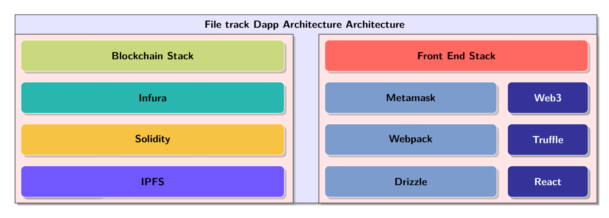

# File-track Dapp 


Simple Dapp that can track files uploaded to IPFS.


Upload and track IPFS files securely on the Ethereum Network, supports UPORT



Images are converted from pdf to png using imagemagick

```sh
convert -density 400 -resize 50% ipfs-dapp.pdf ipfs-dapp.png
```


## Installation

1. Install Truffle and Ganache CLI globally. If you prefer, the graphical version of Ganache works as well!
    ```javascript
    npm install -g truffle
    npm install -g ganache-cli
    ```

2. Download the box. This also takes care of installing the necessary dependencies.
    ```javascript
    truffle unbox drizzle
    ```

3. Run the development blockchain, we recommend passing in a blocktime. Otherwise, its difficult to track things like loading indicators because Ganache will mine instantly.
    ```javascript
    // 3 second blocktime.
    ganache-cli -b 3
    ```

4. Compile and migrate the smart contracts. Note inside the development console we don't preface commands with `truffle`.
    ```javascript
    compile
    migrate
    ```

5. Run the webpack server for front-end hot reloading (outside the development console). Smart contract changes must be manually recompiled and migrated.
    ```javascript
    // Serves the front-end on http://localhost:3000
    npm run start
    ```

6. Truffle can run tests written in Solidity or JavaScript against your smart contracts. Note the command varies slightly if you're in or outside of the development console.
    ```javascript
    // If inside the development console.
    test

    // If outside the development console..
    truffle test
    ```

7. Jest is included for testing React components. Compile your contracts before running Jest, or you may receive some file not found errors.
    ```javascript
    // Run Jest outside of the development console for front-end component tests.
    npm run test
    ```

8. To build the application for production, use the build command. A production build will be in the build_webpack folder.
    ```javascript
    npm run build
    ```
    
 Other doxity options
```sh
  "interaction": {
    "network": "2",
    "providerUrl": "https://morden.infura.io/sign_up_to_get_a_hash"
  },
  // option to whitelist various data
  "whitelist": {
    // the keyname `all` will be used for whitelist defaults
    "all": {
      "abi": true,
      "methods": true,
      "bytecode": false, // bytecode is false or undefined, it won't be shown
      "source": false // source is false or undefined, won't be shown
    },
    "DigixMath": {
      "source": true // source code uniquely shown for this contract, bytecode still hidden
    }
  }
``` 