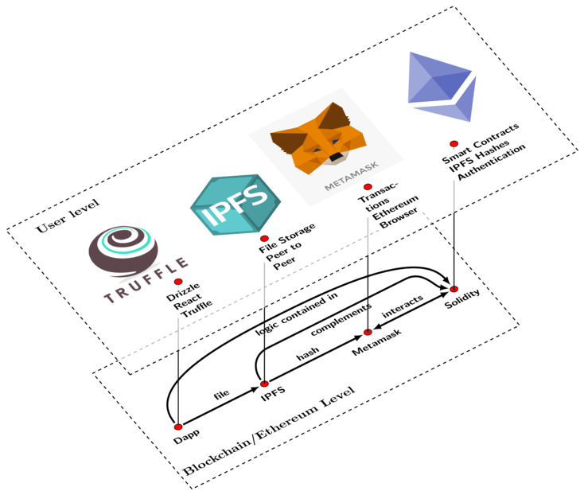

# File-track Dapp 


Simple Dapp that can track files uploaded to IPFS.




Upload and track IPFS files securely on the Ethereum Network, supports UPORT


Images are converted from pdf to png using imagemagick

```sh
convert -density 400 -resize 50% ipfs-dapp.pdf ipfs-dapp.png
```