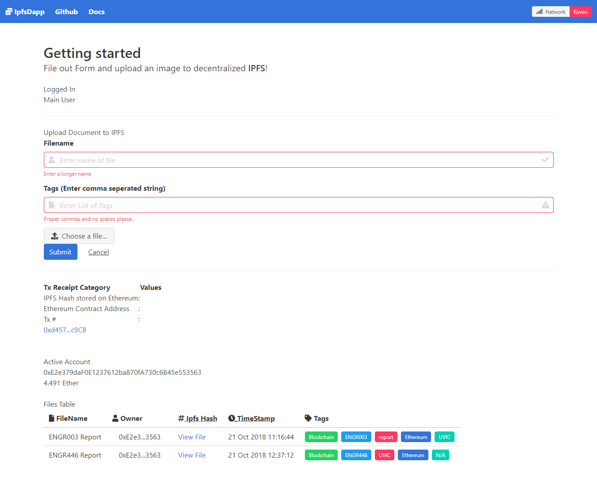

[](https://travis-ci.org/FriendlyUser/file-track-Dapp) [](https://standardjs.com) [](https://coveralls.io/github/FriendlyUser/file-track-Dapp?branch=master)

# File-track Dapp 




Simple Dapp that can track files uploaded to IPFS. See http://ipfsDapp.surge.sh


Upload and track IPFS files securely on the Ethereum Network.


Images are converted from pdf to png using imagemagick

```sh
convert -density 400 -resize 50% ipfs-dapp.pdf ipfs-dapp.png
```

## Tasks

- [x] Add Form Validation 
- [ ] Disable buttons conditionally.
- [ ] Adding tags to smart contract 

|Filename                | IPFS Hash| url |
| ---| ---| ---| 
| ENGR001 Report   | QmSE4qrynVfCU1Vevhvaeav6RWtN5vFKSn3KaC3GuSKPvq | [ENGR001](https://gateway.ipfs.io/ipfs/QmSE4qrynVfCU1Vevhvaeav6RWtN5vFKSn3KaC3GuSKPvq) |
| ENGR002 Report  |QmezncgKe3NEMyN9mmitT3BLwLE3adCNyNDUSJssgCqGXb | [ENGR002](https://ipfs.io/ipfs/QmezncgKe3NEMyN9mmitT3BLwLE3adCNyNDUSJssgCqGXb) |
| ENGR003 Report  | QmZb7crH2YYqwvq5d2pCjZxAovzqXkhWwnEE993UM4jikk | [ENGR003](https://gateway.ipfs.io/ipfs/QmZb7crH2YYqwvq5d2pCjZxAovzqXkhWwnEE993UM4jikk) |
| ENGR446 Report  | QmeQegoUZ3YMNpgUvinU424FtrMUYNNHgQafmaThrzG9nZ |[ENGR446](https://ipfs.io/ipfs/QmeQegoUZ3YMNpgUvinU424FtrMUYNNHgQafmaThrzG9nZ) |

## Installation

1. Install Truffle and Ganache CLI globally. If you prefer, the graphical version of Ganache works as well!
    ```javascript
    npm install -g truffle
    npm install -g ganache-cli
    ```

2. Download the box. This also takes care of installing the necessary dependencies.
    ```javascript
    truffle unbox drizzle
    ```

3. Run the development blockchain, we recommend passing in a blocktime. Otherwise, its difficult to track things like loading indicators because Ganache will mine instantly.
    ```javascript
    // 3 second blocktime.
    ganache-cli -b 3
    ```

4. Compile and migrate the smart contracts. Note inside the development console we don't preface commands with `truffle`.
    ```javascript
    compile
    migrate
    ```

5. Run the webpack server for front-end hot reloading (outside the development console). Smart contract changes must be manually recompiled and migrated.
    ```javascript
    // Serves the front-end on http://localhost:3000
    npm run start
    ```

6. Truffle can run tests written in Solidity or JavaScript against your smart contracts. Note the command varies slightly if you're in or outside of the development console.
    ```javascript
    // If inside the development console.
    test

    // If outside the development console..
    truffle test
    ```

7. Jest is included for testing React components. Compile your contracts before running Jest, or you may receive some file not found errors.
    ```javascript
    // Run Jest outside of the development console for front-end component tests.
    npm run test
    ```

8. To build the application for production, use the build command. A production build will be in the build_webpack folder.
    ```javascript
    npm run build
    ```
    
 Other doxity options
```sh
  "interaction": {
    "network": "2",
    "providerUrl": "https://morden.infura.io/sign_up_to_get_a_hash"
  },
  // option to whitelist various data
  "whitelist": {
    // the keyname `all` will be used for whitelist defaults
    "all": {
      "abi": true,
      "methods": true,
      "bytecode": false, // bytecode is false or undefined, it won't be shown
      "source": false // source is false or undefined, won't be shown
    },
    "DigixMath": {
      "source": true // source code uniquely shown for this contract, bytecode still hidden
    }
  }
``` 